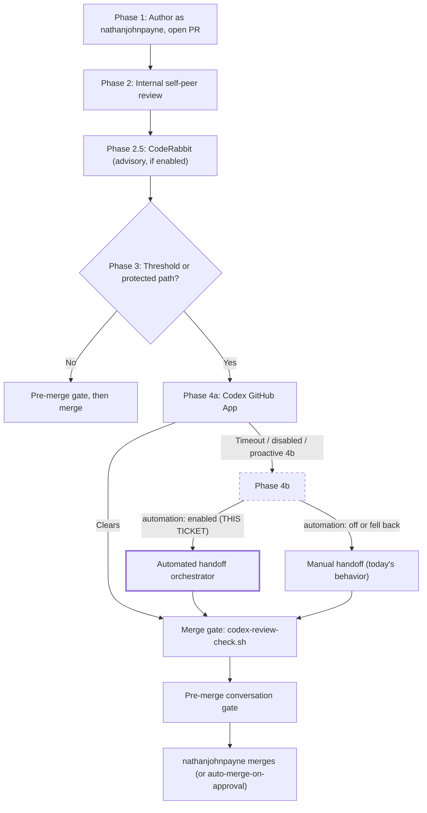
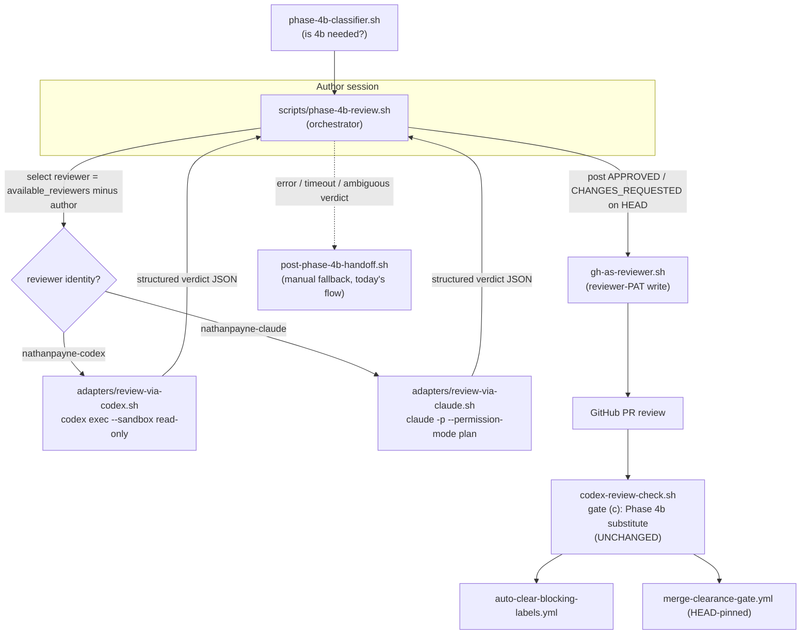
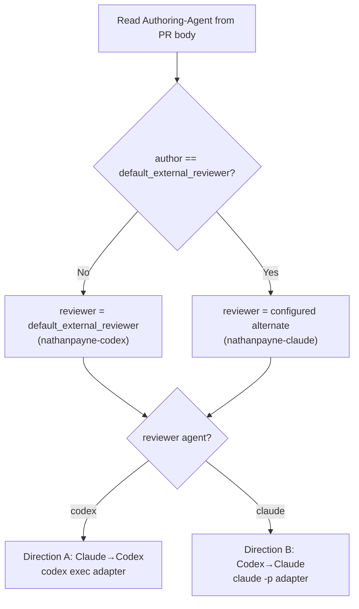
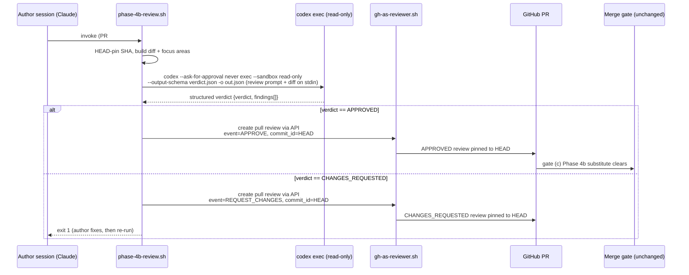
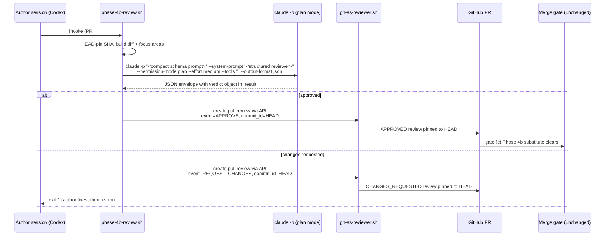
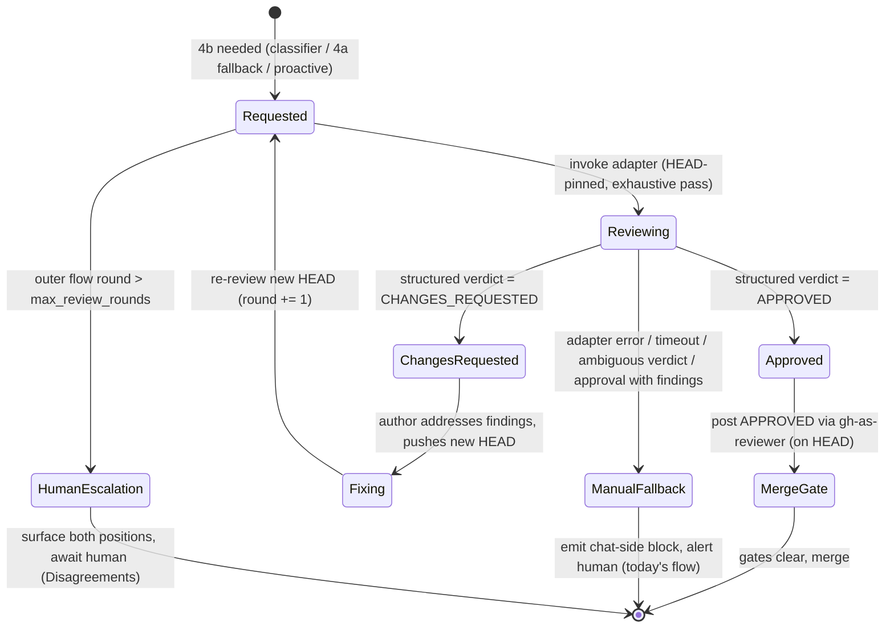

---
tags:
  - mergepath
  - feature-ticket
  - code-review
  - phase-4b
  - automation
status: Proposed
author: Nathan Payne
created: 2026-06-30
related_issues:
  - "#158 (Phase 4b proactive triggers)"
  - "#186 / #187 (phase_4b_default wiring)"
  - "#218 (codex.allow_phase_4b_substitute)"
  - "#281 (chat-side handoff block)"
  - "#427 / #428 (HEAD-pinned merge-clearance gate)"
---

# Feature Ticket: Automated Phase 4b Review Handoff (Claude ⇄ Codex via CLI)

## 1. Summary

Phase 4b—Mergepath's manual CLI fallback for cross-agent external review—is the last human-in-the-loop step on the merge path. Today the originating agent emits a handoff block into chat, a human pastes it into a second agent's CLI session, that agent reviews, and the human shuttles feedback back and forth until an `APPROVED` review lands. This ticket replaces the human shuttle with an **orchestrated, headless CLI invocation** of the external reviewer—the OpenAI **Codex CLI** (`codex exec`) when the reviewer is `nathanpayne-codex`, and the **Claude Code CLI** (`claude -p`) when the reviewer is `nathanpayne-claude`—so a 4b review is requested, produced, posted, and (on approval) merged with little or no human intervention.

The design's load-bearing observation: **the merge gate already accepts the exact artifact we are automating.** `scripts/codex-review-check.sh` gate (c) treats an `APPROVED` review on the current HEAD from a non-author identity in `available_reviewers` as a valid "Phase 4b substitute" clearance (governed by `codex.allow_phase_4b_substitute`, default `true`, #218). So this feature does **not** modify the merge gate, the auto-clear workflow, or the HEAD-pinned merge-clearance gate (#427/#428). It automates only the *production and posting* of that review.

## 2. Background: what a 4b handoff is today

The canonical flow is in `REVIEW_POLICY.md` § Phase 4b (steps 11b–20b) and summarized in `AGENTS.md` step 8. Phase 4b fires when:

- Phase 4a (the ChatGPT Codex Connector GitHub App) times out (`codex-review-request.sh` exit `4`), escalates, or is unavailable (`codex.enabled: false`); or
- `phase_4b_default` routes proactively—`always`, or `complex-changes` when `scripts/phase-4b-classifier.sh` exits `1` (#158/#186/#187).

The current mechanics are deliberately human-mediated:

| Step | Actor | Mechanism |
|------|-------|-----------|
| Post handoff | Originating agent | PR comment (§ Handoff Message Format) + chat-side block from `scripts/post-phase-4b-handoff.sh` (STDOUT-only; never mutates) |
| Carry handoff | **Human** | Pastes the chat-side block into a second CLI session |
| Review | External agent | Reviews PR, posts `APPROVED` / `CHANGES_REQUESTED` / `COMMENTED` |
| Relay feedback | **Human** | Shuttles findings back to the originating agent |
| Fix + re-review | Originating agent → **Human** → external agent | Loop until `APPROVED` |
| Merge | `nathanjohnpayne` | After pre-merge conversation gate is clean |

The two **Human** rows are the cost this ticket removes. `REVIEW_POLICY.md` § Phase 4b Triggers notes the human-mediated handoff "typically adds 30 minutes to a few hours per PR."

## 3. Goals, non-goals, success criteria

**Goals**

- Drive a Phase 4b review end to end by invoking the reviewer's CLI headless, with no human shuttle on the happy path.
- Support both directions with direction-appropriate adapters: `Claude → Codex` and `Codex → Claude`.
- Preserve the multi-identity attribution model: the external review is posted under the reviewer PAT (`nathanpayne-codex` / `nathanpayne-claude`) through `scripts/gh-as-reviewer.sh`.
- Reuse the existing merge gate, auto-clear, and merge-clearance machinery unchanged.
- Degrade gracefully: any adapter error, timeout, or ambiguous verdict falls back to today's manual handoff (fail closed; never auto-approve on doubt).

**Non-goals**

- Changing the merge gate, `codex-review-check.sh`, or branch-protection contract.
- Replacing Phase 4a (the Codex GitHub App). Phase 4a remains the first-choice automated path; this automates the 4b *fallback/proactive* leg.
- Running the reviewer CLIs in GitHub Actions CI. This ticket is **local-first** (see § 11). A CI execution mode is deferred to a follow-up.
- Automating the Cursor reviewer (`nathanpayne-cursor`); the adapter interface is built to admit it later.

**Success criteria.** For a threshold PR routed to 4b, the system requests the review, the reviewer CLI produces a verdict, an `APPROVED` (or `CHANGES_REQUESTED`) review is posted under the correct reviewer identity on the current HEAD, and—on approval—the existing gates clear and the PR merges, with zero human keystrokes on the happy path. The feature is "successful if the 4b handoff occurs automatically with little or no human intervention"; full hands-off operation is the target, not a hard gate.

## 4. Where this sits in the review pipeline

The automated handoff is a drop-in for the manual 4b leg only. Everything upstream (Phases 1–3, 4a) and the merge gate downstream are unchanged.



## 5. Architecture overview

A single **orchestrator** owns the round loop and identity/attribution. It delegates the actual review reasoning to a direction-specific **adapter** that wraps the reviewer's CLI. The adapter is read-only and never posts to GitHub; the orchestrator posts the verdict under the reviewer PAT. This separation is what keeps the multi-identity model intact (the CLI authenticates to its LLM provider; the GitHub write authenticates as the reviewer identity—two different planes, § 11).



The orchestrator mirrors the JSON-contract and exit-code discipline of the existing `scripts/codex-review-request.sh` (HEAD-pinned, idempotent, emits a machine-parseable summary), so callers reason over it the same way.

## 6. Reviewer selection and why direction matters

The reviewer identity is chosen the same way the policy already implies: a member of `available_reviewers` that is **not** the PR's `Authoring-Agent`, defaulting to `default_external_reviewer` (`nathanpayne-codex`) and rotating off it when the author *is* codex.



Direction is not cosmetic. It selects the adapter, the credential, the sandbox/permission model, the prompt shape, and how a verdict is derived—because the two CLIs expose review very differently (§ 9). It also keeps the cross-agent guarantee: the reviewer identity differs from the author, so the posted `APPROVED` is a genuine cross-agent signal and does **not** trip the no-self-approve rule (`REVIEW_POLICY.md` § No-self-approve scoping) or the `gh-pr-guard.sh` block on same-agent over-threshold approvals.

## 7. Direction A — Claude → Codex (`codex exec`)

The authoring agent is Claude; the external reviewer is `nathanpayne-codex`, driven by the Codex CLI in non-interactive mode.



**Why Codex needs more scaffolding.** Per the Codex CLI docs there is **no `codex review` subcommand and no `/review` slash command**; a review is just a prompted `codex exec` run, and Codex CLI emits free-form text with **no native `APPROVED`/`CHANGES_REQUESTED` review state** ([non-interactive mode](https://developers.openai.com/codex/noninteractive), [CLI reference](https://developers.openai.com/codex/cli/reference)). The adapter therefore imposes structure and the orchestrator maps it to a GitHub review state. `codex exec` already defaults to a **read-only sandbox**; we set it explicitly and disable approvals for unattended runs.

Illustrative adapter invocation (flags verbatim from the Codex CLI reference; `git diff`/`gh` are standard tooling):

```bash
# Read-only, never blocks on approval; final message also written to out.json.
git diff "origin/${BASE}...${HEAD_SHA}" \
  | codex --ask-for-approval never exec \
      --sandbox read-only \
      --model "${CODEX_MODEL}" \
      --output-schema scripts/phase-4b/verdict.schema.json \
      -o out.json \
      "You are reviewing GitHub PR #${PR} as an external reviewer. The unified
       diff is on stdin. Return ONLY the schema-conformant verdict object:
       verdict in {APPROVED, CHANGES_REQUESTED}, plus findings[] with
       {severity, path, line, body}. Approve only if you would stake a merge on it."
```

- `--output-schema <file>` forces the final response to conform to a JSON Schema (`{verdict, findings[]}`), which the orchestrator parses deterministically—this is how we recover a review *state* the CLI does not natively emit.
- `-o, --output-last-message <file>` writes the final message to a file (and stdout) for capture.
- Auth is the operator's persisted ChatGPT/Codex plan login via `codex login`. The adapter launches Codex under a tightly allowlisted child environment and an empty scratch review root. Its copied `CODEX_HOME/auth.json` lives outside that root, so a stray metered API key, GitHub token, deploy/cloud credential, SSH agent socket, or user-home file cannot become available to prompt-injected review commands.

The orchestrator then posts the verdict as a GitHub review under the reviewer PAT (never from inside the sandboxed CLI), using the pull-review API so the created review is pinned to the exact reviewed SHA:

```bash
GH_AS_REVIEWER_IDENTITY=nathanpayne-codex \
  scripts/gh-as-reviewer.sh -- gh api "repos/${REPO}/pulls/${PR}/reviews" \
    --method POST --input review-payload.json
```

## 8. Direction B — Codex → Claude (`claude -p`)

The authoring agent is Codex; the external reviewer is `nathanpayne-claude`, driven by Claude Code in print/headless mode.



**Why Claude still uses a wrapper prompt.** Claude Code has built-in review slash commands, but the reference adapter does not let the CLI post GitHub reviews directly. It runs `claude -p` in plan mode with a replacement text-only structured-output system prompt, asks for the same verdict contract the Codex direction uses, validates the response against the shared schema after parsing the print-mode JSON envelope, and leaves GitHub attribution to `scripts/gh-as-reviewer.sh`.

Illustrative adapter invocation:

```bash
claude -p "$PROMPT_WITH_VERDICT_SCHEMA" \
  --system-prompt "$TEXT_ONLY_STRUCTURED_REVIEWER_PROMPT" \
  --permission-mode plan \
  --effort medium \
  --tools "" \
  --safe-mode \
  --disable-slash-commands \
  --no-session-persistence \
  --model "${CLAUDE_MODEL}" \
  --output-format json > out.json
# Parse: jq -r '.result' out.json
```

- The replacement `--system-prompt` keeps Claude Code in text-review mode instead of returning an implementation-planning transcript; the shared verdict contract still lives in the user prompt and the adapter validates the parsed object against `verdict.schema.json`.
- `--permission-mode plan` keeps the run read-only (research/propose, no edits)—the appropriate posture for an unattended reviewer ([permission modes](https://code.claude.com/docs/en/permission-modes)).
- `--effort medium` keeps the large-diff review bounded enough for the adapter timeout while still doing a full review pass.
- `--tools ""` disables Claude Code tools entirely. The diff is already on stdin, so the reviewer does not need `Read` or `Bash`; this prevents prompt-injected diffs from steering the CLI into reading local files or environment state.
- `--output-format json` yields a structured result (result text, `session_id`, cost) for the orchestrator to parse ([headless mode](https://code.claude.com/docs/en/headless)).
- Headless auth uses the operator's Claude Code subscription login, preserving `CLAUDE_CODE_OAUTH_TOKEN` when present. The adapter launches Claude under a tightly allowlisted child environment, so a stray metered API token, GitHub token, deploy/cloud credential, or SSH agent socket cannot become available to prompt-injected review commands.

As in Direction A, attribution is the orchestrator's job:

```bash
GH_AS_REVIEWER_IDENTITY=nathanpayne-claude \
  scripts/gh-as-reviewer.sh -- gh api "repos/${REPO}/pulls/${PR}/reviews" \
    --method POST --input review-payload.json
```

## 9. Direction differences (the core asymmetry)

| Dimension | Claude → Codex (`codex exec`) | Codex → Claude (`claude -p`) |
|-----------|-------------------------------|------------------------------|
| Built-in review affordance used here | None—no `codex review`, no `/review`; review is a prompted `codex exec` | None for posting; review is a prompted `claude -p` run |
| Native review state | None (free-form text) → impose `--output-schema`, map to state | None posted by CLI; prompt for the shared verdict schema inside `.result` |
| Read-only posture | `--sandbox read-only`, scratch `--cd`, isolated scratch HOME/CODEX_HOME + `--ask-for-approval never` | Text-only `--system-prompt`, `--permission-mode plan`, `--effort medium`, `--tools ""`, safe mode, no session persistence |
| Output capture | `--json` (JSONL events) and `-o/--output-last-message <file>` | `--output-format json` (`result`, `session_id`, cost) |
| Structured output | `--output-schema <file>` (schema-validated final message) | Text-only system prompt + compact contract prompt + JSON parse + shared schema validation |
| LLM auth (reasoning plane) | `codex login` / ChatGPT plan login; child env allowlist excludes API keys and ambient credentials | Claude Code subscription login / `CLAUDE_CODE_OAUTH_TOKEN`; child env allowlist excludes API keys and ambient credentials |
| GitHub auth (attribution plane) | `nathanpayne-codex` PAT via `gh-as-reviewer.sh` | `nathanpayne-claude` PAT via `gh-as-reviewer.sh` |
| Session continuation | `codex exec resume --last "..."` | `--resume <id>` / `--continue` / `--session-id` |
| CI option (deferred) | `openai/codex-action@v1` | `anthropics/claude-code-action` |

The single most consequential difference: **Codex gives you reasoning text and nothing structural, so the Codex adapter must manufacture a review state via an output schema and fail closed when the schema is not satisfied; the Claude adapter gets a JSON envelope but still relies on the shared verdict schema in `.result`.** Both converge on the same output—an `APPROVED`/`CHANGES_REQUESTED` review posted under the reviewer PAT—so the orchestrator and the merge gate stay direction-agnostic.

## 10. Review round loop and fail-closed degradation

The reference orchestrator performs one exhaustive adapter pass per invocation: the prompt uses "Exhaustive code review" and asks the reviewer to keep looking for additional findings until it stops finding new issues, then return the full verdict object. `max_review_rounds` is a declarative cap for the outer review flow that re-runs this helper after `CHANGES_REQUESTED`; this first ship does not persist round state inside the helper itself. The key safety property: **the system only ever posts `APPROVED` when an adapter returns an unambiguous approval with no findings at all.** The shared validator still reads the repo's `feedback_policy` (#574; absent policy defaults to P0/P1 required) so blocking findings cannot masquerade as approvals, and the orchestrator adds a stricter posting rule: advisory findings on an approving verdict route to the manual handoff until the required post-review issue filing path has been handled. A parse failure, adapter error, or approval that still carries any finding never becomes an automated approval.



This maps onto existing doctrine: runaway rounds and repeat-after-rebuttal route to `REVIEW_POLICY.md` § Disagreements and Tiebreaking; timeout/unavailability routes to the existing manual handoff via `scripts/post-phase-4b-handoff.sh`.

## 11. Identity, auth, and secrets (two separate planes)

There are two independent authentication planes, and conflating them is the main footgun:

1. **Reasoning plane (LLM provider).** The reviewer CLI authenticates to OpenAI or Anthropic to think, on the operator's **individual subscription plan** — Codex via `codex login` (ChatGPT account, `~/.codex/auth.json` with `auth_mode=chatgpt`); Claude via its subscription login (`claude setup-token` → `CLAUDE_CODE_OAUTH_TOKEN`, or the OS keychain, with `claude auth status --json` reporting `apiProvider=firstParty` and either `authMethod=claude.ai` plus a `subscriptionType`, or `authMethod=oauth_token` for the headless subscription-token path). **Plan-only billing is enforced, not assumed:** the adapters reject persisted API-key auth modes and launch the reviewer CLI under an allowlisted environment, so neither a configured API-key login nor a stray env key can silently divert a handoff review to metered API billing. If the CLI is not plan-logged-in, the read-only call fails and the orchestrator falls back to the manual handoff (fail-closed) — it never bills the API.
2. **Attribution plane (GitHub).** The review must be posted as `nathanpayne-codex` / `nathanpayne-claude` using the reviewer PAT through `scripts/gh-as-reviewer.sh`, which verifies the effective token identity before the write (`REVIEW_POLICY.md` § PAT lookup table; Operation-to-Identity Matrix). GitHub tokens stay in the parent orchestrator process only; the reviewer CLI child process receives only a minimal allowlist (`PATH`, `HOME`, locale/tmp basics, and `CODEX_HOME` or `CLAUDE_CODE_OAUTH_TOKEN` when needed), so prompt-injected diffs cannot use the reasoning CLI to read GitHub tokens, deploy/cloud credentials, or SSH-agent state from the parent session. Before the final GitHub write, the orchestrator sets `GH_AS_REVIEWER_IDENTITY` and clears a stale `OP_PREFLIGHT_REVIEWER_PAT` from the authoring agent session so `gh-as-reviewer.sh` resolves and verifies the selected external reviewer rather than the current agent.

Because the sandboxed/plan-mode CLI runs read-only, it **cannot** post the GitHub review itself; the orchestrator does, on the reasoning plane's behalf. This is a feature, not a limitation: it guarantees the posted review carries verified reviewer-identity attribution rather than whatever ambient token the CLI happened to hold.

Secrets follow the existing 1Password + `op-preflight` model (local-first; this is why CI execution is out of scope here). Two new credential items are introduced—a Codex CLI credential and a Claude OAuth token—resolved at session start via `scripts/op-preflight.sh` alongside the reviewer PATs, never written to disk in plaintext beyond the existing chmod-600 session cache, and never exported as job-level env vars around repo-controlled code (per the Codex docs' explicit warning).

## 12. Configuration (new `review-policy.yml` knobs)

Illustrative additions to `.github/review-policy.yml`. Defaults preserve today's behavior (`enabled: false` → manual handoff), so existing consumers see no change until they opt in—mirroring the `phase_4b_default` migration posture.

```yaml
phase_4b_automation:
  enabled: false              # master switch; false = today's manual handoff
  mode: local                 # local (this ticket) | manual ; ci is future
  max_review_rounds: 2        # declarative cap for outer re-run loops
  fail_closed: true           # ambiguous/parse-fail verdict => never APPROVE
  fallback_on_error: manual-handoff
```

The reference implementation ships this exact block (disabled) in `.github/review-policy.yml`. A flat top-level key is used rather than a nested `phase_4b.automation` to avoid colliding with the existing `phase_4b_default` scalar and to keep the awk policy reader shallow. Non-security adapter knobs (for example reviewer model and timeout) are read from environment variables / flags with safe defaults in the reference; read-only sandbox, permission mode, and allowed tools are pinned in code and cannot be widened by env override. Promoting safe knobs into the YAML block is a follow-up. The block is additive and does not alter the existing `codex:`, `dependabot:`, or top-level keys the merge gate reads.

## 13. New and changed components

**New**

- `scripts/phase-4b-review.sh`—the orchestrator. HEAD-pins, selects reviewer/direction, invokes the adapter for one exhaustive pass, parses the verdict, posts via `gh-as-reviewer.sh`, emits a JSON summary, and falls back on error. Exit-code contract mirrors `codex-review-request.sh`: `0` approved+posted, `1` changes requested (author fixes), `3` error, `4` fell back to manual handoff, `5` automation disabled/skipped.
- `scripts/phase-4b/adapters/review-via-codex.sh`—wraps `codex exec` (Direction A).
- `scripts/phase-4b/adapters/review-via-claude.sh`—wraps `claude -p` (Direction B).
- `scripts/phase-4b/verdict.schema.json`—the JSON Schema both adapters normalize to (`{verdict, summary, findings[], usage?}`), with `usage` populated only from CLI metadata when exposed rather than model guesses.
- `scripts/phase-4b/lib.sh`—shared config readers, reviewer selection, bounded-execution helper, and the `jq` verdict validator that mirrors the schema.
- `scripts/phase-4b/README.md`—package overview, dependencies, and enable instructions.
- `scripts/ci/check_phase_4b_automation` + `tests/test_phase_4b_automation.sh`—wired into `repo_lint.yml` (the `check_ci_scripts_wired` meta-check requires every `scripts/ci/check_*` be wired or `# WIRED-EXEMPT`).

**Changed**

- `scripts/post-phase-4b-handoff.sh`—unchanged in behavior, but now the explicit fallback target when automation is off or errors.
- Docs: `REVIEW_POLICY.md` § Phase 4b (document the automated sub-path and its fail-closed posture), `AGENTS.md` step 8, `CLAUDE.md` step 8.5.

**Explicitly unchanged**

- `scripts/codex-review-check.sh` (merge gate), `merge-clearance-gate.yml`, `auto-clear-blocking-labels.yml`, branch protection. The posted `APPROVED` satisfies gate (c)'s Phase 4b substitute and gate (b) branch 1 as-is.

## 14. Security considerations

- **Prompt injection via PR diff.** A hostile diff could try to steer the reviewer CLI toward a spurious approval. Mitigations: the adapter runs read-only (Codex `--sandbox read-only`, Claude `--permission-mode plan`), so the CLI cannot act on injected instructions; the orchestrator—not the CLI—posts the review; and `fail_closed: true` means any non-conformant or ambiguous verdict routes to the manual handoff rather than `APPROVED`. Protected-path and threshold rules continue to apply upstream.
- **Credential isolation and pinned writes.** The reviewer CLI receives the diff but only a minimal allowlisted environment, excluding GitHub tokens, pay-per-token API keys, deploy/cloud credentials, and SSH-agent state. All GitHub write authority remains in the parent orchestrator and flows through `gh-as-reviewer.sh` after the current PR head is re-read. The write uses the pull-review API with `commit_id` set to the reviewed SHA, then verifies the created review response reports that same SHA, so prompt injection cannot convert reasoning-plane execution into a direct PR write or an unpinned approval.
- **Hung reviewer CLI.** Auth, network, rate-limit, or tool hangs are bounded by adapter and CLI timeouts (`P4B_ADAPTER_TIMEOUT_SECONDS` / `P4B_REVIEW_CLI_TIMEOUT_SECONDS`, default `900`). Timeout is classified as an adapter error and falls back to the manual handoff instead of wedging the Phase 4b path.
- **Auto-approve is now a real merge signal.** Because the posted `APPROVED` clears the gate, the bar for emitting it must be high: only an unambiguous, schema-conformant approval on the *current* HEAD. Never infer approval from a partial parse.
- **Findings cannot clear the gate as an automated approval.** The shared verdict validator reads `feedback_policy` and rejects `APPROVED` responses that contain findings in any required severity tier before either adapter output or orchestrator output can be posted. The orchestrator then applies the stricter repository process rule: an `APPROVED` verdict with any remaining findings falls back to the manual handoff so the post-review issue path can be handled before a Phase 4b substitute approval clears merge gates. With no `feedback_policy` block, P0/P1 remain required and P2/P3 remain advisory for verdict validity; with `mode: address-all`, any finding is required.
- **Credential blast radius.** New CLI credentials are scoped, resolved via `op-preflight`, and never exported as job-level env around repo-controlled code (Codex docs' explicit warning). The adapters additionally use a child-process environment allowlist (§ 11) so review reasoning runs only on the operator's subscription-plan login and cannot inspect ambient deploy/cloud credentials from the parent session. Reviewer PATs keep their existing minimal scope; the GitHub write still flows through the token-verifying `gh-as-reviewer.sh`.
- **Attribution integrity.** The two-plane split (§ 11) guarantees the review byline is the verified reviewer identity, not the CLI's ambient token.
- **Audit metadata.** The posted review body records the reviewed head SHA, reviewer identity, adapter, adapter run count, timeout, and token usage when the CLI exposes a reliable count. If a CLI does not expose usage, the body says so explicitly; adapters must not ask the model to estimate its own token usage.

## 15. Acceptance criteria

1. For a threshold PR with `phase_4b.automation.enabled: true`, running the orchestrator selects a reviewer ≠ author, invokes the matching adapter headless, and posts an `APPROVED` or `CHANGES_REQUESTED` review under the reviewer PAT on the current HEAD—no human shuttle on the happy path.
2. On `APPROVED`, `scripts/codex-review-check.sh` clears (gate (c) Phase 4b substitute), `auto-clear-blocking-labels.yml` removes `needs-external-review`, and the PR merges (manually or via the existing opt-in `auto-merge-on-approval` + `AUTHOR_MERGE_TOKEN`).
3. On `CHANGES_REQUESTED`, findings post under the reviewer identity, the orchestrator exits `1`, and the outer review flow may re-run it after fix commits to review the new HEAD; that outer loop is bounded by `max_review_rounds`, after which it escalates to the human.
4. Direction A and Direction B both produce a posted review; the Codex direction derives its state from `--output-schema`, and the Claude direction derives it from the shared verdict schema inside the text-only `claude -p --output-format json` envelope.
5. Adapter error, timeout, or ambiguous verdict falls back to `scripts/post-phase-4b-handoff.sh` (today's manual flow); the system never auto-approves on a parse failure (`fail_closed`).
6. The merge gate, merge-clearance gate, and auto-clear workflow are byte-unchanged.
7. `check_phase_4b_automation` is wired into `repo_lint.yml` with a passing `tests/test_phase_4b_automation.sh`.
8. Defaults (`enabled: false`) leave existing consumers' behavior unchanged.

## 16. Phased rollout

1. **Schema + adapters (read-only, dry-run).** Land `verdict.schema.json` and both adapters behind `mode: manual`; have them print the verdict they *would* post. No GitHub writes. Validate verdict quality against a sample of recently-merged PRs (cf. the matchline #158 evidence base).
2. **Orchestrator + posting, Mergepath-only.** Wire posting via `gh-as-reviewer.sh` and the one-pass helper; enable `automation: enabled` in Mergepath's own `.github/review-policy.yml` first (the same narrow-start posture as `codex.p1_gate` / the merge-clearance gates).
3. **Auto-merge composition.** Confirm the existing `auto-merge-on-approval` path arms on the automated `APPROVED` for true zero-touch merge.
4. **Propagate to consumers.** Add the `phase_4b.automation` block to the templated surface; consumers opt in explicitly.

## 17. Approval-loop accounting (#602)

Every automated Phase 4b approval now carries its own rigor / cost / time / quality story so an operator never reconstructs it after the fact (as had to happen on #580). The reconciled source of truth is [`plans/issue-602-phase-4b-accounting-SPEC.md`](issue-602-phase-4b-accounting-SPEC.md); this section is the design summary.

- **Where it lives.** `scripts/phase-4b/accounting.sh` (sourced by the orchestrator; pure functions over JSON, unit-testable offline via `tests/test_phase_4b_accounting.sh` / `scripts/ci/check_phase_4b_accounting`) renders a `## Phase 4b Approval Accounting` block that the orchestrator appends to the **body of the automated `APPROVED` review** — the same HEAD-pinned pull-review POST as today, no separate comment. The block embeds a machine-readable `<!-- p4b-accounting:v1 ... -->` record validated by `scripts/phase-4b/accounting.schema.json`.
- **Loop-centric.** Each orchestrator invocation appends one loop record to a per-PR loop log (`.mergepath/phase-4b-loops/…`, gitignored runtime state), including CHANGES_REQUESTED rounds and fail-closed fallbacks (recorded as positive safety evidence: reason + duration), so the final approval renders the whole changes-requested-then-fixed history, the findings lifecycle (first/last loop, disposition, fix-commit/issue links), and a rigor proof-of-work table whose rows are green only when the backing signal was captured (else `n/a — reason`).
- **Advisory to safety, fail-closed for integrity.** Report-generation failure ⇒ the orchestrator posts its existing plain-summary approval (exit codes unchanged); accounting can never block or fabricate an approval. Conversely the builder/renderer refuse (fail closed) any record whose loop history would pair a posted `APPROVED` with a required-tier (P0/P1 by default) finding, tokens are never estimated (`unavailable` with source/reason), and running totals degrade to `unavailable` rather than guessing.
- **Cost model.** Billed marginal cost is `$0.00` (plan-only auth); the block additionally reports wall-clock, CLI-exposed tokens (the additive nullable `usage` fields in `verdict.schema.json` carry cache/reasoning/cost when the CLI envelope exposes them), plan-capacity throttle events, a **notional** metered-API equivalent priced from the versioned `scripts/phase-4b/prices.json` (`price_table_version` stamped into every record; missing price ⇒ `n/a`, record still posts), and the cited human-shuttle-avoided range from REVIEW_POLICY.md § Phase 4b Triggers.
- **Running totals.** Aggregated at post time from prior `p4b-accounting:v1` records — an injected GitHub-derived record file (`P4B_ACCT_PRIOR_RECORDS_JSONL`, produced by piping prior review bodies through `p4b_acct_extract_records`) wins; the append-only `.mergepath/phase-4b-ledger.jsonl` cache is the fallback; neither ⇒ the section says `unavailable` with the reason. The totals source is always named in the block footer.
- **Toggles.** `phase_4b_automation.accounting.enabled` (default `true` under the disabled-by-default parent) plus opt-in `accounting.{codex,claude}_price_key` mappings for the notional figure — the adapters do not capture exact model IDs yet, so pricing is never inferred.

## 18. Open questions

- **Verdict reliability bar.** What false-approval rate is acceptable before auto-posting `APPROVED` versus defaulting to `COMMENTED` + human confirm during phase 1–2?
- **Codex output schema fidelity.** Does `--output-schema` constrain `codex exec` tightly enough to trust the mapped state, or should the Codex direction also gate on a confirmation pass?
- **Outer loop persistence.** If a follow-up wants fully automatic re-run loops, persist and enforce `max_review_rounds` outside the one-pass helper so runaway review cycles still escalate cleanly.
- **Cursor reviewer.** Worth a third adapter now, or defer until the interface stabilizes?
- **Latency budget — initial default.** Headless reviewer CLI execution is bounded at 900 seconds by default (`P4B_ADAPTER_TIMEOUT_SECONDS` / `P4B_REVIEW_CLI_TIMEOUT_SECONDS`) before manual fallback. Tune this after observing live wall-clock behavior across several 4b reviews.
- **Billing model — resolved.** Reviewer CLIs run on the operator's individual subscription plans, never the pay-per-token API. Enforced in the adapters by rejecting persisted API-key auth modes (`auth_mode != chatgpt` for Codex; Claude auth status must be `apiProvider=firstParty` with `authMethod=claude.ai` plus a subscription type, or `authMethod=oauth_token`) and by launching the child CLI under an allowlisted environment that excludes API-key env vars and ambient credentials. Both paths are covered by `tests/test_phase_4b_automation.sh`. A configurable API-billing mode — for a CI or org runner that has no plan login — is a deferred follow-up, not part of this reference.

## 19. References

**Internal**

- `REVIEW_POLICY.md` § Phase 4b (steps 11b–20b), § Phase 4b Triggers, § Handoff Message Format, § No-self-approve scoping, § Disagreements and Tiebreaking, § Implementation notes for branch protection gates.
- `AGENTS.md` § Workflow (step 8), step 4 reviewer-write wrappers.
- `scripts/codex-review-request.sh` (JSON/exit-code contract template), `scripts/codex-review-check.sh` (merge gate; gate (c) Phase 4b substitute), `scripts/phase-4b-classifier.sh`, `scripts/post-phase-4b-handoff.sh`, `scripts/gh-as-reviewer.sh`, `scripts/op-preflight.sh`.
- `.github/review-policy.yml` (`codex.allow_phase_4b_substitute`, `phase_4b_default`, `available_reviewers`, `default_external_reviewer`).
- `.github/workflows/merge-clearance-gate.yml`, `auto-clear-blocking-labels.yml`.

**Codex CLI**

- Overview — https://developers.openai.com/codex/cli
- Non-interactive mode (`codex exec`, auth, JSON) — https://developers.openai.com/codex/noninteractive
- CLI command-line options (flags) — https://developers.openai.com/codex/cli/reference
- CLI features (local code review) — https://developers.openai.com/codex/cli/features
- Codex SDK — https://developers.openai.com/codex/sdk
- GitHub Action (`openai/codex-action@v1`, deferred CI option) — https://developers.openai.com/codex/github-action

**Claude Code CLI**

- CLI reference — https://code.claude.com/docs/en/cli-reference
- Headless / print mode — https://code.claude.com/docs/en/headless
- Commands reference (`/review` for a GitHub PR, `/code-review` for a local diff) — https://code.claude.com/docs/en/commands
- Permission modes — https://code.claude.com/docs/en/permission-modes
- Settings (allowed tools) — https://code.claude.com/docs/en/settings
- Authentication (`claude setup-token`, `CLAUDE_CODE_OAUTH_TOKEN`) — https://code.claude.com/docs/en/authentication
- GitHub Actions (deferred CI option) — https://code.claude.com/docs/en/github-actions
